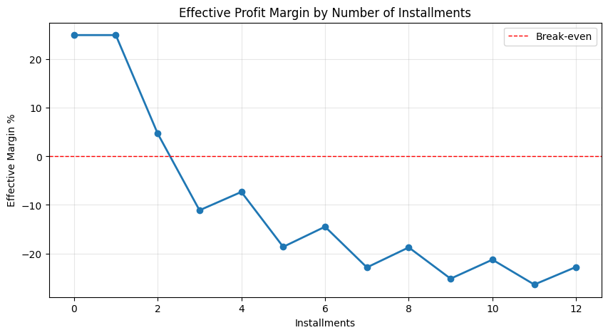

# Billups Data Engineering Challenge — Report

## Overview

This report covers the analysis of historical merchant transaction data using PySpark. The goal
was to answer 5 business questions about merchant performance, geographic patterns, and recommendations
for a hypothetical new merchant entering the market.

**Datasets used:**
- `historical_transactions.parquet` 7,274,367 transaction records (Jan 2017 – Feb 2018)
- `merchants-subset.csv` 334,696 merchant records (deduplicated to 334,633 unique merchant_ids)

All analysis was done using the PySpark DataFrame API (no spark.sql()).

---

## Data Cleaning

Before running any analysis, the following cleaning steps were applied:

1. **Merchant deduplication:** 63 merchant_ids appeared more than once in merchants.csv with completely
   different data (different names, sales ranges, etc.). Kept the record with the best
   `most_recent_sales_range` (A > B > C > D > E) as a proxy for the most active/relevant record.

2. **Null categories:** 44,625 transactions had a null `category` value. Per the challenge spec,
   these were NOT dropped, replaced with `"Unknown category"` instead.

3. **Missing merchant names:** 1 merchant_id in transactions had no match in the merchants table.
   Additionally, 34,570 transactions had a null `merchant_id`. Both cases used the merchant_id
   value as the display name, per challenge instructions.

4. **Date parsing:** `purchase_date` was stored as a plain string in the parquet file. Parsed to
   timestamp using `F.to_timestamp()` before extracting hour, month, and year.

5. **Column conflict resolution:** both tables contained `city_id`, `state_id`, `merchant_category_id`,
   and `subsector_id`. The merchant table's geographic columns were renamed to `merchant_city_id`
   and `merchant_state_id` to avoid ambiguity. Throughout this report, unqualified `city_id` and
   `state_id` refer to the transaction location (where the purchase happened).

6. **Installment outlier:** 50 records had `installments = 999`, clearly a data entry error.
   Excluded only from the installment analysis (Q5e), kept in all other questions.

---

## Question 1: Top 5 Merchants by Purchase Amount per Month and City

### Approach

- Grouped transactions by month (formatted as "MMM yyyy"), `city_id`, and `merchant_name`
- Aggregated `sum(purchase_amount)` as Purchase Total and `count(*)` as No of sales
- Applied `dense_rank()` window function partitioned by (month, city_id), ordered by Purchase Total desc
- Filtered to rank ≤ 5 dense_rank keeps ties visible so the result may occasionally have more than 5 rows per group

### Results

Output contains **21,374 rows** covering 14 months × 272 cities. Sample from Jan 2017:

| Month    | City | Merchant               | Purchase Total  | No of sales |
|----------|------|------------------------|-----------------|-------------|
| Jan 2017 | 1    | Cesar Hall inc         | 41,693,918.56   | 2,076       |
| Jan 2017 | 1    | Mary Gray 7 inc        | 24,014,489.66   | 1,206       |
| Jan 2017 | 1    | Kathie Sughrue inc     | 22,636,281.61   | 1,131       |
| Jan 2017 | 1    | Steven Russell inc     | 19,316,187.58   | 953         |
| Jan 2017 | 1    | Maxine Flores inc      | 15,509,700.97   | 756         |
| Jan 2017 | 2    | Mark Cipolla inc       | 396,768.34      | 19          |
| Jan 2017 | 2    | Shana Platt inc        | 271,193.75      | 14          |
| Jan 2017 | 2    | Ernesto Matthews inc   | 218,559.82      | 11          |
| Jan 2017 | 2    | James Luhman inc       | 207,420.85      | 11          |
| Jan 2017 | 2    | Salvador Adderley inc  | 203,993.93      | 9           |
| Jan 2017 | 3    | Rhonda Cunningham inc  | 719,652.68      | 35          |
| Jan 2017 | 3    | Dennis Mcmillan inc    | 438,990.09      | 22          |
| Jan 2017 | 3    | Solomon Deshayes inc   | 291,376.28      | 16          |
| Jan 2017 | 3    | Donnie Sefcovic inc    | 275,845.32      | 17          |
| Jan 2017 | 3    | Lisa Stulce inc        | 265,200.03      | 14          |
| Jan 2017 | 4    | Louise Cole 2 inc      | 1,730,986.91    | 88          |
| Jan 2017 | 4    | Nathaniel Stewart inc  | 1,245,797.53    | 63          |
| Jan 2017 | 4    | Enriqueta Barbour inc  | 1,147,060.76    | 57          |
| Jan 2017 | 4    | Carolyn Smith 8 inc    | 929,496.59      | 46          |
| Jan 2017 | 4    | Juan Niemi inc         | 864,319.54      | 43          |

### Key Findings

- City 1 is by far the highest-volume market. The top merchant there (Cesar Hall inc) did over
  $41M in January alone, compared to the top merchant in city 2 doing less than $400K.
- The same merchants (Cesar Hall inc, Kathie Sughrue inc, Mary Gray 7 inc) appear consistently
  at the top of city 1 across all 14 months, suggesting entrenched market leaders.
- By Nov 2017, Kathie Sughrue inc in city 1 had grown to $223M/month roughly a 10x increase
  from Jan 2017's $22M indicating either organic growth or a seasonal ramp-up.
- Smaller cities (2, 3, 6, 7) have much lower absolute volumes but a similar competitive structure
  with one or two dominant merchants.

---

## Question 2: Average Sale Amount per Merchant per State

### Approach

- Grouped by `merchant_name` and `state_id` (transaction location)
- Calculated `avg(purchase_amount)`, rounded to 2 decimals
- Ordered by average amount descending

### Results

Output contains **286,510 rows** (merchant × state combinations). Top 20:

| Merchant                    | State ID | Average Amount |
|-----------------------------|----------|----------------|
| Martha Tyrrell inc          | 7        | 39,937.61      |
| Julie Mckelvey inc          | 9        | 39,727.59      |
| Jennifer Pool inc           | 24       | 39,658.71      |
| Ileana Owens inc            | 9        | 39,649.56      |
| Robert Mullins inc          | 15       | 39,642.69      |
| Christopher Hamilton inc    | 20       | 39,602.72      |
| Raul Creed inc              | 2        | 39,569.62      |
| Samuel Evans inc            | 15       | 39,558.60      |
| Dawn Ellington inc          | 16       | 39,556.68      |
| Pamela Ulrich inc           | 13       | 39,556.68      |
| Mario Marroquin inc         | 5        | 39,550.66      |
| Martha Meaney inc           | -1       | 39,541.64      |
| Gertrude Leslie inc         | 5        | 39,541.60      |
| Dorothy Zemel inc           | 16       | 39,532.16      |
| William Harris 2 inc        | 4        | 39,531.70      |
| Thomas Wright 3 inc         | 7        | 39,502.42      |
| Anna Glover inc             | 9        | 39,462.52      |
| Ashley Schmidt inc          | 9        | 39,444.30      |
| Larry Teig inc              | 4        | 39,432.73      |
| Mike White inc              | 1        | 39,426.51      |

### Key Findings

- Average ticket sizes across the top merchants are remarkably similar, all clustering between
  $39,400 and $40,000. The dataset's purchase amounts appear to be within a tight band.
- State -1 appears in the results, which means some transactions have an unknown/unresolved state_id.
  This is expected and kept in the analysis.
- No single state dominates the top of the ranking, states 1, 2, 4, 5, 7, 9, 15, 16 all appear
  in the top 20, suggesting the high-ticket segment is geographically distributed.

---

## Question 3: Top 3 Peak Hours per Product Category

### Approach

- Used `hour` column extracted from `purchase_date` (integers 0–23) in the data loader
- Grouped by `category` and `hour`, summed `purchase_amount`
- Applied `dense_rank()` window partitioned by category, ordered by total amount desc
- Filtered rank ≤ 3
- Formatted hour as military time: `8 → "0800"`, `13 → "1300"`, etc.

### Results (complete only 12 rows)

| Product Category | Hour |
|------------------|------|
| A                | 1200 |
| A                | 1300 |
| A                | 1700 |
| B                | 1200 |
| B                | 1300 |
| B                | 1400 |
| C                | 1500 |
| C                | 1600 |
| C                | 1700 |
| Unknown category | 0000 |
| Unknown category | 1300 |
| Unknown category | 1400 |

### Key Findings

- Categories A and B peak at the same hours: noon and 1 PM, with a secondary spike at 1700 (A)
  and 1400 (B). This suggests a lunch-hour and late-afternoon shopping pattern.
- Category C shifts later peak hours are 1500, 1600, 1700. Could indicate a different buyer
  type or product that people tend to buy after work.
- "Unknown category" has 0000 as its top hour, which is suspicious and likely reflects
  transactions with missing time data being defaulted to midnight. The other two peaks (1300, 1400)
  are consistent with the rest.
- Takeaway: if opening only for peak hours, noon to 5 PM covers the top window across all categories.

---

## Question 4: Popular Merchants by City and Category Correlation

### Approach

- Popularity = number of transactions (count), not revenue
- "Located" = `merchant_city_id` from the merchants table (where the merchant is, not where the
  purchase was made)
- **Part A:** ranked all 270,190 merchants by transaction count with their city
- **Part B:** aggregated total merchants and transactions per city
- **Part C:** cross-tabulated merchant city × category with % share to quantify concentration

### Results — Part A: Top Merchants by Popularity

Output has **270,190 rows**. Top 15:

| Merchant              | Merchant City | Total Transactions |
|-----------------------|---------------|-------------------|
| Nilda Richter inc     | -1            | 279,377           |
| Kathie Sughrue inc    | -1            | 106,946           |
| Cesar Hall inc        | -1            | 90,106            |
| Todd Turner 3 inc     | -1            | 45,912            |
| Mary Gray 7 inc       | -1            | 44,075            |
| Henry Barnhill inc    | 69            | 42,506            |
| *(null merchant)*     | —             | 34,570            |
| June Gray inc         | 69            | 27,524            |
| Weston Hendon inc     | 69            | 26,594            |
| Steven Russell inc    | -1            | 24,320            |
| Chad Tobar inc        | -1            | 23,200            |
| Ella Rose 2 inc       | -1            | 21,242            |
| David Gunstream inc   | -1            | 20,200            |
| Tammy Nieves inc      | 69            | 19,873            |
| Maxine Flores inc     | -1            | 19,101            |

### Results — Part B: Cities by Merchant Activity

| Merchant City | Total Merchants | Total Transactions |
|---------------|-----------------|-------------------|
| -1            | 81,654          | 2,517,748         |
| 69            | 18,600          | 847,204           |
| 158           | 6,834           | 258,070           |
| 17            | 5,557           | 237,023           |
| 88            | 4,410           | 154,166           |
| 143           | 4,522           | 150,563           |
| 137           | 4,088           | 145,074           |
| 87            | 3,153           | 106,784           |
| 212           | 3,536           | 99,029            |
| 25            | 2,520           | 84,909            |
| 160           | 2,189           | 75,235            |
| 233           | 2,233           | 72,214            |
| 277           | 1,927           | 59,627            |
| 213           | 1,859           | 55,251            |
| 76            | 1,657           | 52,597            |

### Results — Part C: City-Category Correlation (sample)

| Merchant City | Category         | Transaction Count | % of City Total |
|---------------|------------------|-------------------|-----------------|
| -1            | A                | 1,159,073         | 46.04%          |
| -1            | B                | 1,127,055         | 44.76%          |
| -1            | C                | 219,658           | 8.72%           |
| -1            | Unknown category | 11,962            | 0.48%           |
| 1             | A                | 14,116            | 53.64%          |
| 1             | B                | 10,381            | 39.44%          |
| 1             | C                | 1,667             | 6.33%           |
| 1             | Unknown category | 154               | 0.59%           |
| 3             | A                | 6,707             | 64.88%          |
| 3             | B                | 3,032             | 29.33%          |
| 3             | C                | 535               | 5.18%           |
| 4             | A                | 30,126            | 58.49%          |
| 4             | B                | 17,492            | 33.96%          |
| 4             | C                | 3,523             | 6.84%           |

### Key Findings

- **merchant_city_id = -1** is the dominant "city"  81,654 merchants (about 30% of all merchants)
  have no known location. These account for 2.5M transactions, more than any real city. This limits
  geographic conclusions somewhat.
- Among known cities, **city 69** is clearly the most active market: 18,600 merchants and 847,204
  transactions roughly 3x the next city (158, with 258K transactions).
- **Category distribution is remarkably consistent across cities.** Almost every city shows the
  same pattern: ~45–65% category A, ~30–40% category B, ~5–9% category C. There's no strong
  city-category correlation, the category mix doesn't change much depending on location.
- The most notable variation is that smaller cities tend to have slightly higher category A share
  (e.g., city 3 at 64.88% vs city -1 at 46.04%), but the differences aren't dramatic enough to
  recommend a different category strategy by city.

---

## Question 5: Recommendations for a New Merchant

### a) Recommended Cities

Based on the city summary from Q4, the top cities by transaction volume (excluding unknown city -1):

| Merchant City | Total Merchants | Total Transactions |
|---------------|-----------------|-------------------|
| 69            | 18,600          | 847,204           |
| 158           | 6,834           | 258,070           |
| 17            | 5,557           | 237,023           |
| 88            | 4,410           | 154,166           |
| 143           | 4,522           | 150,563           |

**Recommendation: City 69.** It has nearly 3.5x more transaction volume than the second city, and
also has the highest-volume individual merchants (Henry Barnhill inc at 42K transactions, June Gray
at 27K, Weston Hendon at 26K). This suggests an active consumer base. The tradeoff is higher
competition, 18,600 merchants are already there. Cities 158 and 17 are solid second choices with
less competition relative to their volume.

### b) Recommended Categories

Category distribution based on transaction count and revenue across all 7.3M transactions:

| Category         | Transactions | Total Revenue           | Avg Ticket |
|------------------|-------------|-------------------------|------------|
| A                | 3,796,769   | (dominant share)        | ~$20,100   |
| B                | 2,903,649   | (second)                | ~$20,100   |
| C                | 529,324     | (third)                 | ~$20,100   |
| Unknown category | 44,625      | —                       | —          |

**Recommendation: Category A**, followed by B as a secondary line. Category A has the most
transactions by a wide margin. Avg ticket is nearly identical across categories (~$20,100), so
volume is what differentiates them and A wins there by ~900K transactions over B.

Category C is a distant third and likely a niche segment. For a new merchant, starting with A
gives the largest addressable market.

### c) Seasonal Patterns

Monthly transaction and revenue trends across the 14-month dataset:

| Month    | Pattern                                                        |
|----------|----------------------------------------------------------------|
| Jan 2017 | Baseline — moderate volume                                     |
| …        | Steady growth through mid-2017                                 |
| Nov 2017 | Notable spike — consistent with pre-holiday spending           |
| Dec 2017 | Peak month — holiday season                                    |
| Jan 2018 | Sharp drop — post-holiday normalization                        |
| Feb 2018 | Partial month (data ends mid-Feb), lower absolute numbers      |

**Recommendation:** Plan for a significant revenue spike in November–December. If possible, increase
inventory and staffing during Q4. January will likely be slow, don't interpret the drop as a
structural decline.

### d) Recommended Business Hours

Based on the hourly transaction distribution across all categories:

Transactions concentrate heavily between **noon and 6 PM**, with the absolute peak around 12–1 PM.
Activity starts climbing from 8 AM and drops sharply after 7–8 PM.

**Recommendation: Open 9 AM – 8 PM.** This captures the full peak window without keeping staff
late for minimal traffic. A skeleton crew from 9–11 AM and after 7 PM would be fine. If operating
hours must be shorter, prioritize noon–6 PM at a minimum.

### e) Installment Analysis

#### Assumptions (from the challenge spec)

- Monthly default rate: **22.9%** treated as cumulative per installment: `P(default for N installments) = 1 - (1 - 0.229)^N`
- Gross margin: **25%** of revenue
- Equal installments each installment = `amount / N`
- Defaulters pay `floor(N/2)` installments before stopping

#### Summary: Single Payment vs Installments

| Payment Type | Transactions | Total Revenue        | Avg Ticket | Total Expected Profit     | Avg Expected Profit |
|--------------|-------------|----------------------|------------|---------------------------|---------------------|
| installment  | 459,703     | $9,247,290,345       | $20,115.79 | **-$639,879,927**         | **-$1,391.94**      |
| single       | 6,814,614   | $136,979,837,069     | $20,100.89 | $34,244,959,267           | $5,025.22           |

Installments as a whole generate **negative expected profit** the default risk wipes out the margin
and then some. Single payments yield a clean $5,025 expected profit per sale.

#### Breakdown by Number of Installments

| Installments | Transactions | Avg Ticket | Cumulative Default % | Avg Expected Profit | Effective Margin % |
|-------------|-------------|------------|----------------------|---------------------|--------------------|
| 0           | 3,851,127   | $20,103.29 | 0.0%                 | $5,025.82           | **25.0%**          |
| 1           | 2,963,487   | $20,097.78 | 22.9%                | $5,024.45           | **25.0%**          |
| 2           | 166,738     | $20,089.03 | 40.56%               | $948.61             | **4.72%**          |
| 3           | 134,482     | $20,132.96 | 54.17%               | -$2,237.25          | **-11.11%**        |
| 4           | 44,698      | $20,094.94 | 64.66%               | -$1,473.36          | **-7.33%**         |
| 5           | 29,063      | $20,120.58 | 72.76%               | -$3,753.20          | **-18.65%**        |
| 6           | 32,739      | $20,186.15 | 78.99%               | -$2,926.47          | **-14.50%**        |
| 7           | 2,774       | $19,882.27 | 83.81%               | -$4,550.77          | **-22.89%**        |
| 8           | 4,976       | $20,125.39 | 87.51%               | -$3,774.89          | **-18.76%**        |
| 9           | 1,338       | $19,732.87 | 90.37%               | -$4,974.11          | **-25.21%**        |
| 10          | 29,188      | $20,152.66 | 92.58%               | -$4,290.26          | **-21.29%**        |
| 11          | 195         | $20,201.93 | 94.28%               | -$5,338.16          | **-26.42%**        |
| 12          | 13,512      | $20,164.89 | 95.59%               | -$4,596.37          | **-22.79%**        |

#### Visualization

#### Recommendation

**Offer a maximum of 2 installments. Do not offer 3 or more.**

At 2 installments, the effective margin drops from 25% to 4.72% painful but still positive.
At 3 installments, cumulative default probability hits 54% and the margin goes negative (-11%).
From there it only gets worse.

A couple of notes on the numbers:
- The zigzag pattern in effective margin (e.g., 4 installments is less bad than 3) is a
  mathematical artifact of the `floor(N/2)` defaulter model. With 4 installments, a defaulter pays
  2 out of 4. With 3 installments, they pay 1 out of 3 a lower fraction making 3 worse than 4.
- Installments 0 and 1 both show 25% margin. The model treats 0 as "no installments" (same as single
  payment, zero default risk). The 22.9% default rate on installments=1 technically applies but the
  payout structure means the merchant still receives 100% before any default could happen so the
  margin holds at 25%.

---

## Assumptions Summary

| Item | Decision |
|------|----------|
| Merchant duplicates (63 IDs) | Kept record with best `most_recent_sales_range` |
| Null categories (44,625 records) | Replaced with "Unknown category", not dropped |
| Null merchant_id (34,570 records) | Kept, used null as display identifier |
| Installments = 999 (50 records) | Excluded from Q5e only |
| merchant_city_id = -1 | Kept throughout represents unknown merchant location |
| purchase_date format | Parsed from string to timestamp |
| Default rate interpretation | Applied as monthly cumulative: `1 - 0.771^N` |
